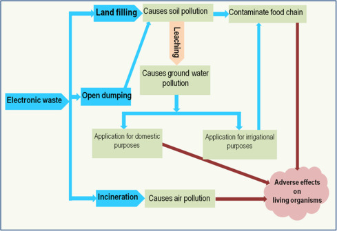

# Smart India Hackathon Workshop
# Date:9-5-2024
## Register Number:212221040112
## Name:V.Natchathira Rajan
## Problem Title
E-Waste Facility Locator
## Problem Description
Website that tells you the location of the nearest e-waste collection and recycling facility. Offers educational pop-ups on the harmful components of your e-waste and their effects on the environment and human health if not disposed correctly. There could be an option to input the model of your old device and earn credit points relative to the amount of precious metals recovered from the device if disposed correctly.
## Problem Creater's Organization
Ministry of Environment

## Idea
The user visits the website and inputs their location or allows the website to access their location.
The website uses a geolocation API to determine the user's location and searches for nearby e-waste facilities using a database of facilities and their locations.
The user can view the nearest facilities on a map and select one to visit.
As the user navigates the website, educational pop-ups appear with information about the harmful components of e-waste and their effects on the environment and human health.The user can input the model of their old device and receive information about the amount of precious metals that can be recovered from the device.
The user can earn credit points based on the amount of precious metals that can be recovered from their device.

## Proposed Solution / Architecture Diagram
The proposed solution consists of a web application that allows users to locate the nearest e-waste collection and recycling facility. The application will use the user's location to search for nearby facilities and display them on a map. The user can then select a facility and get directions to it.

The application will also include educational pop-ups that provide information about the harmful components of e-waste and their effects on the environment and human health. Additionally, the application will allow users to input the model of their old device and earn credit points relative to the amount of precious metals recovered from the device if disposed correctly.

## Use Cases

The E-Waste Facility Locator is created by the Ministry of Environment and uses a variety of technologies, including React or Vue.js for the front-end, Python or Java with Django or Spring Boot for the back-end, PostgreSQL or MySQL for the database, and a geolocation API for determining the user's location and searching for nearby e-waste facilities. The website also uses custom implementations for educational pop-ups and the credit point system ensuring a seamless user experience.

## Technology Stack
For the front-end, you could use a modern JavaScript framework like React or Vue.js to build the user interface. These frameworks are popular, well-documented, and have a large community of developers who can provide support and resources.

For the back-end, you could use a language like Python or Java with a web framework like Django or Spring Boot. These technologies are widely used in enterprise applications and have many libraries

## Flowchart

## Dependencies

Mapping API: Dependency on Google Maps API for location services and displaying e-waste facility locations.

Third-Party APIs: Integration with APIs for credit points calculation and possibly for accessing e-waste facility data.

Educational Content: Dependence on reliable sources for educational content on e-waste and environmental impact. By implementing this solution, EcoRecycle can provide a user-friendly platform for responsible e-waste disposal, educate users on environmental issues, and incentivize sustainable behavior.

